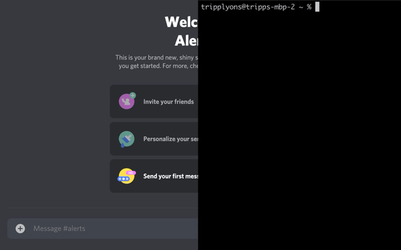

# alert-me
A shell utility that sends you a message through different means (Discord, [Amazon Echo](https://www.thomptronics.com/about/notify-me))

`echo hi | alert-me`



## Usage

### Installation
```
npm i -g alert-me
```

### Setup (Configuration Tool)

```
alert-me --config
```

### Sending messages

#### To the default provider

```
echo "message" | alert-me
```

#### To a chosen provider

```
echo "message" | alert-me discord
```

#### To all providers

```
echo "message" | alert-me all
```

### Node API

```
const alertMe = require("alert-me")
alertMe("message")
alertMe("message", "discord")
alertMe("message", "echo")
```
